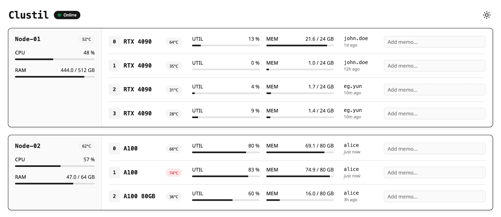

# Clustil UI

A minimal GPU cluster dashboard for real-time node and GPU metric monitoring, including temperature and memory usage.

> [!NOTE]
> Clustil Backend is currently **under development**. Please explore the dashboard using demo mode.



Explore the dashboard on the [Live Demo Page](https://yuneg11.github.io/clustil-ui/).

## Features

- Real-time monitoring
- Node and GPU metrics: temperature, utilization, memory usage
- User assignment tracking per GPU
- Memo/notes support for individual GPUs

## Quick Start

### Prerequisites

- [Bun](https://bun.sh/) v1.3.8 or later

### Installation

```bash
bun install
```

### Running in Standalone Demo Mode

Standalone demo mode uses generated mock data, no backend required:

```bash
bun run dev:demo
```

Open [http://localhost:5173](http://localhost:5173) in your browser.

### Running with Demo Backend Server

1. Start the development SSE server:

```bash
bun run dev:server
```

2. In another terminal, start the frontend:

```bash
bun run dev
```

Open [http://localhost:5173](http://localhost:5173) in your browser.
The frontend connects to the SSE server at [http://localhost:3001](http://localhost:3001).

## Configuration

Environment variables are prefixed with `CLUSTIL_`:

| Variable       | Description                         | Default                 |
| -------------- | ----------------------------------- | ----------------------- |
| `CLUSTIL_NAME` | Dashboard title displayed in header | `Clustil`               |
| `CLUSTIL_HOST` | Backend server URL                  | `http://localhost:3001` |

Create a `.env` file in the project root:

```env
CLUSTIL_NAME=My Cluster
CLUSTIL_HOST=http://your-server:3001
```

## Development

### Commands

| Command              | Description                               |
| -------------------- | ----------------------------------------- |
| `bun run dev`        | Start development server                  |
| `bun run dev:demo`   | Start in demo mode (mock data)            |
| `bun run dev:server` | Start the demo backend server (mock data) |
| `bun run build`      | Production build                          |
| `bun run build:demo` | Production build for standalone demo mode |
| `bun run preview`    | Preview production build                  |
| `bun run check`      | Run linter and formatter checks           |
| `bun run check:fix`   | Auto-fix linting and formatting issues     |
| `bun run prepare`    | Install git hooks for development         |

### Code Quality

This project uses [Biome](https://biomejs.dev/) for linting and formatting. Run `bun run check:fix` before committing. Git hooks are configured via Husky to run checks automatically. To install git hooks, run:

```shell
bun run prepare
```

### Project Structure

```text
src/
├── components/
│   ├── ui/           # shadcn/ui components (auto-generated)
│   ├── dashboard.tsx # Main dashboard layout
│   ├── node.tsx      # Node card component
│   ├── gpu.tsx       # GPU item component
│   └── theme.tsx     # Theme provider and toggle
├── hooks/
│   ├── useSSE.ts     # SSE connection hook
│   └── useDemo.ts    # Demo data hook
├── lib/
│   ├── utils.ts      # Utility functions
│   ├── demo.ts       # Demo data generation
│   └── memo.ts       # Memo utilities
├── types.ts          # TypeScript interfaces
├── App.tsx           # Root component
└── main.tsx          # Entry point

scripts/
└── server.ts         # Development SSE server
```

### Adding UI Components

UI components are from [shadcn/ui](https://ui.shadcn.com/) with Base UI styling:

```bash
bunx shadcn@latest add <component-name>
```

Components are installed to `src/components/ui/` and should not be edited directly.

## API

### SSE Endpoint

`GET /stream` - Server-Sent Events stream for real-time updates.

Messages are JSON with the following structure:

```typescript
// Full update (sent on connect and periodically)
{ type: "full", data: Node[] }

// Delta update (frequent, only changed values)
{ type: "delta", data: DeltaData }
```

### Memo API

`POST /api/memo` - Set or clear a memo for a GPU.

Request body:

```json
{
  "nodeId": "node-1",
  "gpuId": "gpu-0",
  "text": "Reserved for training job"
}
```

## Tech Stack

- **Runtime**: [Bun](https://bun.sh/)
- **Framework**: [React 19](https://react.dev/)
- **Language**: [TypeScript](https://www.typescriptlang.org/)
- **Styling**: [Tailwind CSS 4](https://tailwindcss.com/)
- **UI Components**: [shadcn/ui](https://ui.shadcn.com/) with [Base UI](https://base-ui.com/)
- **Icons**: [Lucide](https://lucide.dev/)
- **Build Tool**: [Vite](https://vitejs.dev/)
- **Linter/Formatter**: [Biome](https://biomejs.dev/)

## License

Licensed under the [MIT License](./LICENSE).
